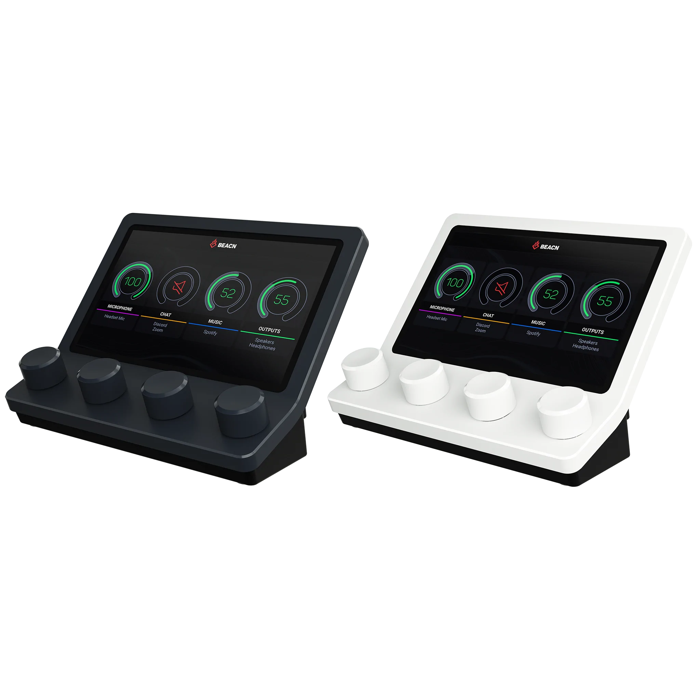

# About

The [Beacn Mix](https://www.beacn.com/products/beacn-mix) is a digital audio mixer. It is controlled and setup via the [Beacn App](https://www.beacn.com/pages/downloads), which is currently Windows only.

This project attempts to make a Linux version of the Beacn App which would allow you to control your Beacn Mix via Linux.

# Application overview

I'm in the very early stages of development, so right now my goal is to make a command-line version that can do basic communication with the device, before moving onto creating a GUI.

# Setup

Currently all that exists is a C++ application that uses `libusb` to communicate with the device.

This application lives in the `cpp` directory, and is built via C-Make:

```bash
$ cmake CMakeLists.txt
```

# Device documentation

The device communicates with your PC via a single USB-c connection.

`docs/README.md` contains USB information about the device (via `dmesg` and `lsusb`). The USB vendor ID and product ID are also shown below:

| Vendor ID | Product ID |
| --------  | ---------  |
| 0x33ae    |   0x0004   |

# *How can I help?*

To develop this, I'm using a Windows VM with the real Beacn Mix application, and using Wireshark to record the USB traffic between the device and the VM.

The `wireshark` folder contains said wireshark packet captures. The end of the filename has a string that looks like "x_yy", where x is the bus number and yy is the device number -- e.g. (1.11) -- this way you know which device's traffic to isolate in the packet capture.

